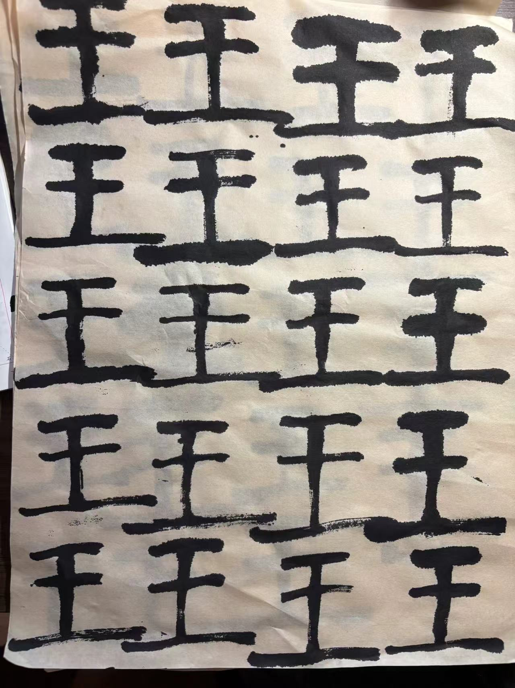

近期对中国的传统文化兴致愈发浓郁。究其原因，一方面是各种优秀的新兴文化产品（于我而言可能是各种国产游戏动画）作为载体，让它们在我面前曝光的机会越来越多。另一方面，随着自己人生经历的增长，对不期再会的，曾不甚理解的古文诗歌有了更深的感悟和共鸣。正所谓“初闻不识曲中意，再闻已是曲中人”。

正恰逢假期去日本旅游，行至金泽高山这些偏远小城，发现了很多古时一方藩主大名或亲题或收藏的书道作品。以本人的门户之见，实不能和书法大家流传下的逸品作比。然则确乎提升了本人对书法的兴趣（这些大名写的这么难看也好意思传下来，我有啥不能写的 :joy: ）。于是购置了一套文房四宝，想看看自己是否对此有些兴致。

在网络上搜索一番入门建议，看到了陈忠建先生的[书法课堂](https://space.bilibili.com/278761627)。决定以小篆体入门，以热情为燃料，出发！

至于目标嘛，每天5张宣纸吧，先以能写自己的名字做目标。:wink:

Abandon...Abandon...Abandon...

