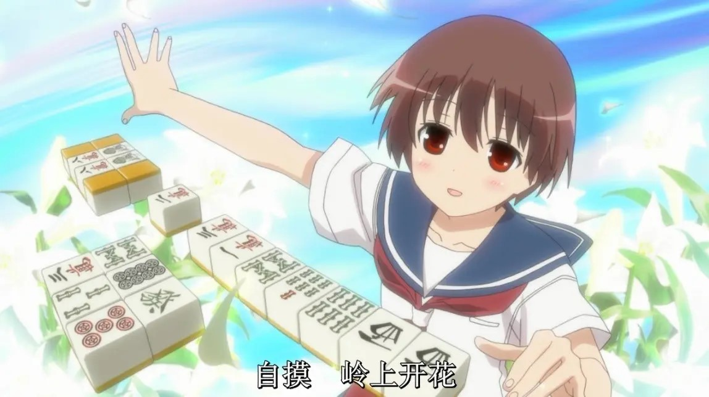

前段时间公司有好事者组织了一个娱乐麻将比赛，竟是以雀魂作为平台的日麻比赛。

本人虽已多年没正经打过雀，但仍饶有兴致地报名了这个比赛。因为这对我来说绝对是新鲜事儿，一个国内的软件公司，竟能办起一个日麻比赛？在我的个人印象里，这玩意儿是小众中的小众，冷门中的冷门，在很长一段时间内，我身边都没有出现一个对日麻有所耳闻的人。

比赛的过程其实没什么可讲的，本人在第二轮淘汰赛就早早地出局。当然这其实也不怎么让人难过，淘汰赛的赛制是两个半庄前二晋级，这种盘数下的麻将是彻头彻尾的运气游戏，一个顶级打者输给只懂得规则的初心者的概率也远大于0。真正让我感叹的是，竟然有小一百人参加了这个比赛。

我不得不感叹时代变了，回忆一点点地在脑海里泛起波澜：

初次接触麻将应是很小的时候，许是还没上小学，在农村老家的日子。依稀记得爷爷家有一个不大不小的院子，每当农闲之时，村里乡亲们便三五成群，来到院里摆起一个个四方桌，好不热闹。麻将作为一种赌博游戏，自然是有赌资的，但那个时候村民们自然是没什么钱，所以爷爷都是从门檐上薅下几根玉米棒子，把玉米粒分发给大家，权当是做筹码。夜幕降临，桌上聚粒成塔的人也好，空空如也的人也罢，就都尽兴而归了。而留下来的这些筹码，许是被爷爷拿去喂鸡了。

我们这些小辈虽经常在一旁观看，爷爷却从不让我们上桌。一方面，赌博对小孩子不好，这种朴素的道理大家都明白。另一方面，小孩子容易较真（输不起），在家里哭闹起来，坏了大伙儿兴致，爷爷脸上也无光。加之爸妈似乎对麻将也不感兴趣（他们更喜欢打牌），所以我在那时候是事实上的云玩家，在一边指点江山，却从来没机会上手。

真正第一次实际上手麻将应该是初中，那个时候入宅不久，对当时的同人王者东方系列有着异常的狂热。不仅打通了红魔乡到风神录的EX,甚至还在网上找人匹配打则……咳咳，扯远了，总之是接触到了一个叫《东方幻想麻雀》的二次同人游戏。那个时候不懂日文，靠着对麻将的朴素理解以及“哪里亮了点哪里”这一准绳艰难攻略。那时我就遇到了一个所有日麻初心者都会遇到的问题，TMD明明四搭一雀头都成了为啥不给胡？当然我那时根本不知道有日本麻将这个东西，我是把这一现象作为游戏bug理解的，然则我在长时间的try and error过程中，也发现了我胡出来的牌大多时候都会写这行字**“断幺九”**。哈哈，我自以为找到了武林秘籍，成为了断幺狂魔。

这份困扰其实并没有纠缠我很久，大致就在同年，一个真正将麻将带入我生活的作品出现了，那就是[《天才麻将少女-咲Saki》](https://mzh.moegirl.org.cn/%E5%A4%A9%E6%89%8D%E9%BA%BB%E5%B0%86%E5%B0%91%E5%A5%B3)。

麻雀って、楽しいね。

